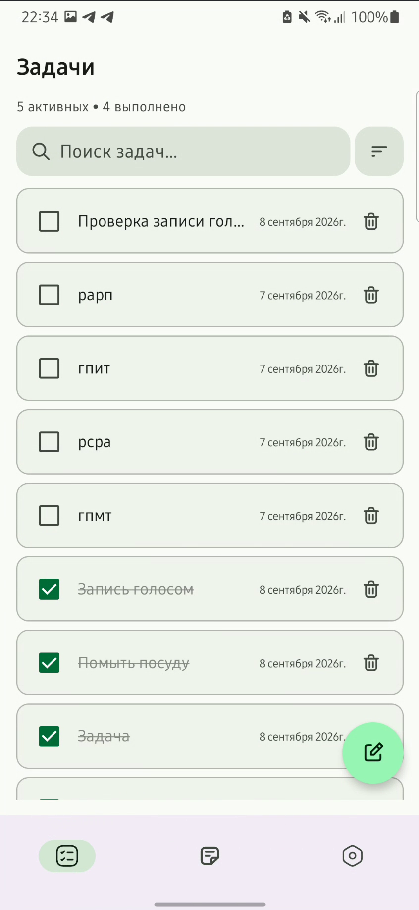
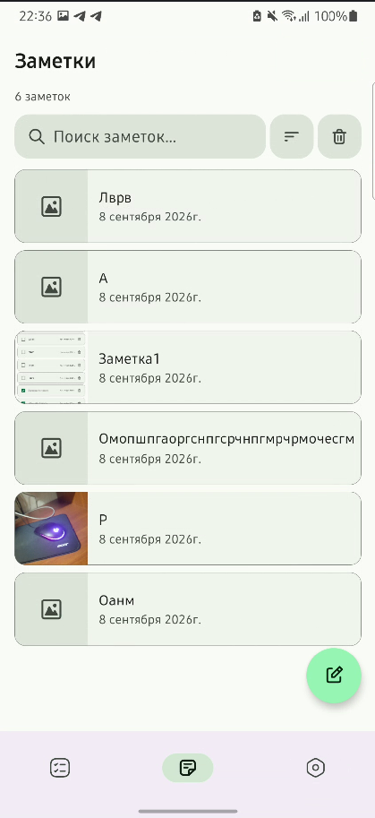
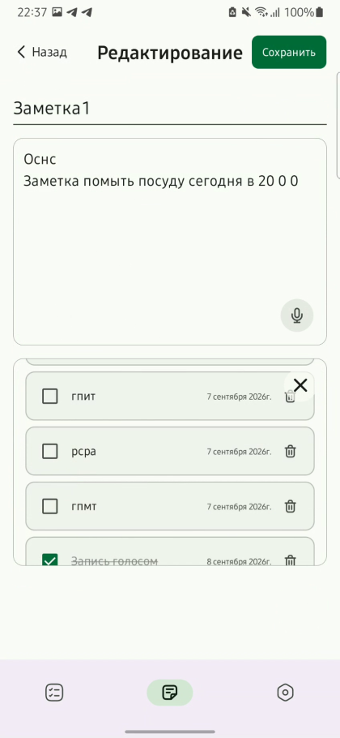
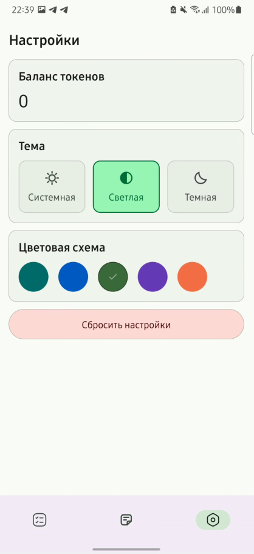
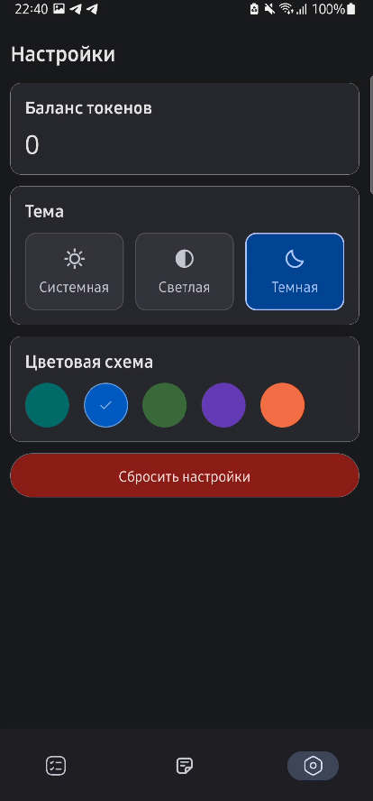
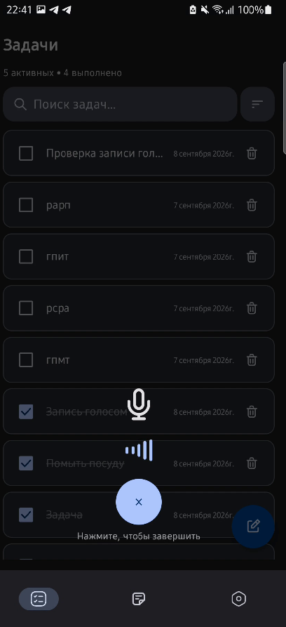
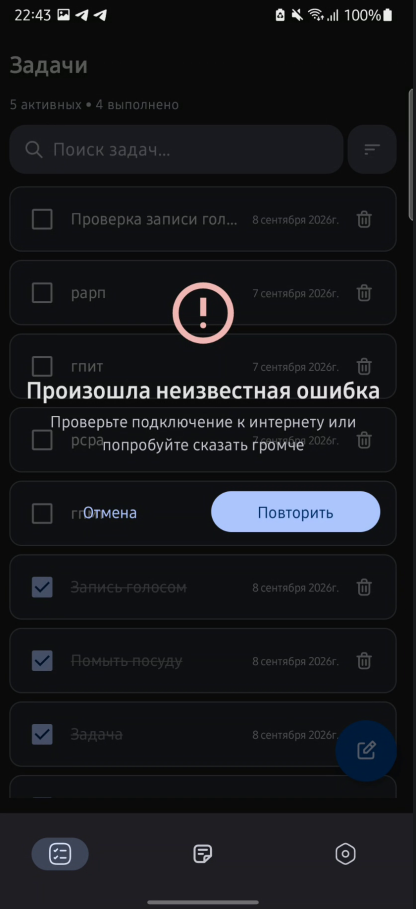
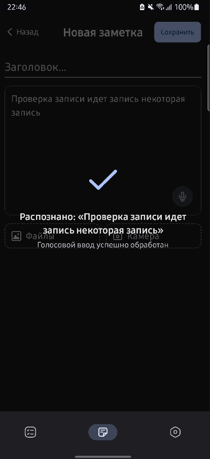
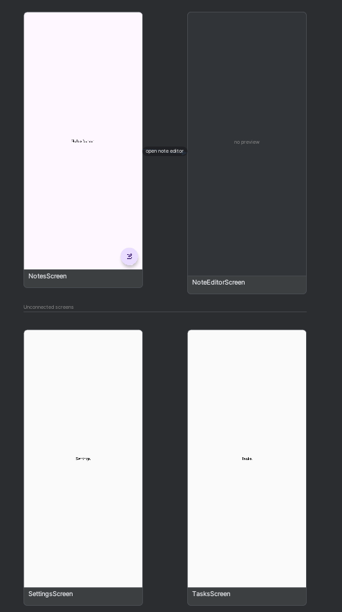

# TaskManager - Android Application

[](https://developer.android.com/)
[](https://kotlinlang.org/)
[](https://developer.android.com/jetpack/compose)
[](https://developer.android.com/about/versions/8.0)

Приложение для управления задачами и заметками с поддержкой голосового ввода и распознавания речи.

---

## Видео

Ссылка на yandex диск: https://disk.yandex.ru/d/P9wD6UJU281DrQ
## Скриншоты

<table>
  <tr>
    <td align="center">
      <br/>
      <em>Список задач</em>
    </td>
    <td align="center">
      <br/>
      <em>Список заметок</em>
    </td>
  </tr>
  <tr>
    <td align="center">
      <br/>
      <em>Редактор заметок</em>
    </td>
    <td align="center">
      <br/>
      <em>Светлая тема</em>
    </td>
  </tr>
  <tr>
    <td align="center">
      <br/>
      <em>Темная тема</em>
    </td>
    <td align="center">
      <br/>
      <em>Запись голоса</em>
    </td>
  </tr>
  <tr>
    <td align="center">
      <br/>
      <em>Ошибка записи</em>
    </td>
    <td align="center">
      <br/>
      <em>Успешная запись</em>
    </td>
  </tr>
</table>

---

## Архитектура

- Постарался сделать что-то подобное MVI, не держать много состояний во viewmodel, а прокидывать все через event и effect

### Стек технологий

| Компонент | Технология |
|-----------|-----------|
| **UI** | Jetpack Compose + Material 3 |
| **State Management** | Kotlin Coroutines + Flow + StateFlow |
| **DI** | Hilt (Dagger) |
| **Navigation** | Jetpack Navigation Compose 2 (Kotlinx Serialization) |
| **Local DB** | Room |
| **Preferences** | DataStore |
| **Voice** | Android SpeechRecognizer + Yandex Speech API (Retrofit + OkHttp) |
| **Images** | Coil |

### Модульная структура

```
taskmanager/
├── app/                          # Главный модуль: MainActivity, навигация, тема
├── core/                         # Общие модули
│   ├── data/                     # Repository interfaces for app settings + DataStore (настройки)
│   ├── database/                 # Room DB, entities, DAOs
│   ├── designsystem/             # UI компоненты, тема, иконки
│   └── voice/                    # Voice recording + speech-to-text
└── feature/                      # Фичи
    ├── notes/                    # Заметки (CRUD, поиск, сортировка, изображения, голосовой ввод)
    ├── tasks/                    # Задачи (CRUD, поиск, сортировка, голосовой ввод)
    └── settings/                 # Настройки (тема, палитра)
```

#### Описание модулей

| Модуль | Назначение                                                                                                                                      |
|--------|-------------------------------------------------------------------------------------------------------------------------------------------------|
| **`app`** | Точка входа: `MainActivity`, `App` composable, навигация (`AppNavHost`), `MainActivityViewModel`                                                |
| **`core:data`** | Общие репозитории (настройки приложения), DataStore интеграция                                                                                  |
| **`core:database`** | Room база данных: `TaskManagerDatabase`, сущности (`NoteEntity`, `TaskEntity`), DAO                                                             |
| **`core:designsystem`** | Переиспользуемые UI компоненты: `BottomNavigationBar`, `SearchField`, `SortDropdownMenu` и др., `TaskManagerTheme` (5 палитр × 2 темы = 10 схем) |
| **`core:voice`** | Голосовой ввод: `VoiceRecognizer`, `AndroidAudioRecorder`, интеграция с Yandex Speech API                                                       |
| **`feature:notes`** | Фича заметок: экран списка, редактор заметок, голосовой ввод заметок, use cases, DI                                                             |
| **`feature:tasks`** | Фича задач: экран списка, голосовой ввод задач, use cases, DI                                                                                   |
| **`feature:settings`** | Настройки приложения: тема, цветовая палитра                                                                                                    |

### Навигация

```
AppNavHost
├── NotesBaseRoute
│   ├── NotesRoute → NotesScreen (список)
│   └── NoteEditorRoute(noteId?) → NoteEditorScreen (создание/редактирование/просмотр)
├── TasksBaseRoute
│   └── TasksRoute → TasksScreen
└── SettingsBaseRoute
    └── SettingsRoute → SettingsScreen
```

<div align="center">
  <br/>
  <em>Навигация</em>
</div>

---

## Реализованные функции

### Задачи (Tasks)
- [x] Создание задач текстом
- [x] Создание задач голосовым вводом
- [x] Удаление задач
- [x] Отметка задач как выполненных
- [x] Поиск по задачам
- [x] Сортировка (по дате / по статусу)
- [x] Сохранение задач в Room

### Заметки (Notes)
- [x] Создание заметок
- [x] Редактирование заметок
- [x] Удаление заметок
- [x] Поиск по заметкам
- [x] Сортировка (новые/старые)
- [x] Голосовой ввод в редакторе заметок
- [x] Прикрепление изображений (галерея + камера)
- [x] Просмотр списка заметок с превью
- [x] Сохранение задач в Room

### Настройки (Settings)
- [x] Выбор темы (Follow System / Light / Dark)
- [x] Выбор цветовой палитры (5 цветов)
- [x] Сохранение настроек в DataStore
- [x] Обработка запросов разрешений

### Общее
- [x] Splash Screen

---

## Тестирование

- Тесты нагенерированы, но проверить все не успел

## Нереализованные функции

- Не реализовал получение количества токенов от GigaChat, так как использовал YandexApi, там не нашел подобного api
- Тем не менее реализовать такой запрос при созданной уже архитектуре очень просто


## Технические плюшки

- Использовал Detekt и prepush хуки, но из-за нехватки времени добавил пока что просто baseline и оставил
- В данный момент токены для ИИ сохраняются в локальном файле local.properties

---


# Что я хотел бы добавить при наличии времени

- Рассматривалась возможность внедрения **convention plugins**
- Протестировал бы более тщательно моками и различными инструментальными тестами
- Пагинацию списка
- Сейчас я поверхностно обрабатывал ошибки, не все кейсы учел скорее всего, добавил бы класс Result, составил бы ответы, понятные пользователю, при различных родах ошибок (сетевых, например)
- Хранение токенов сейчас только локальным может быть, так как нет бэка, можно хранить в android keystore, это на мой взгляд один из самых безопасных возможных вариантов
---
